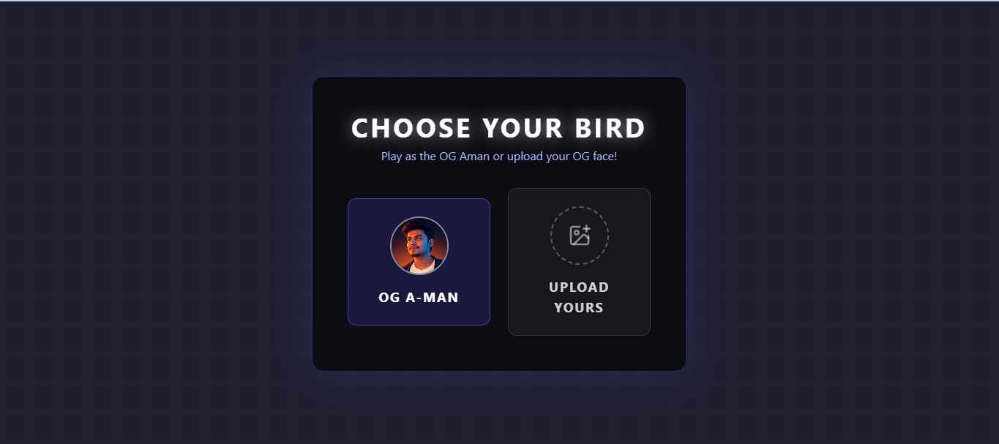
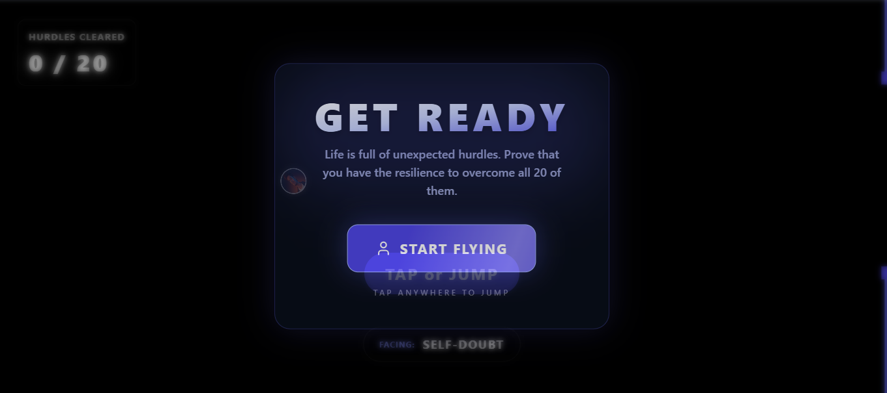
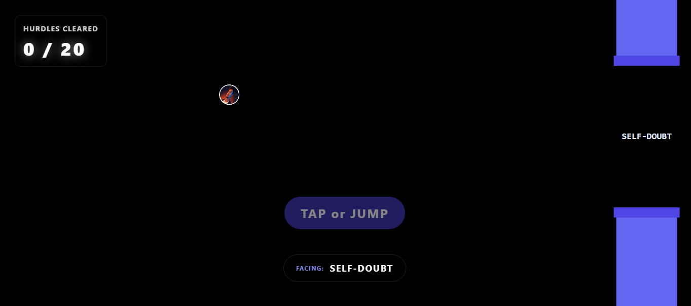
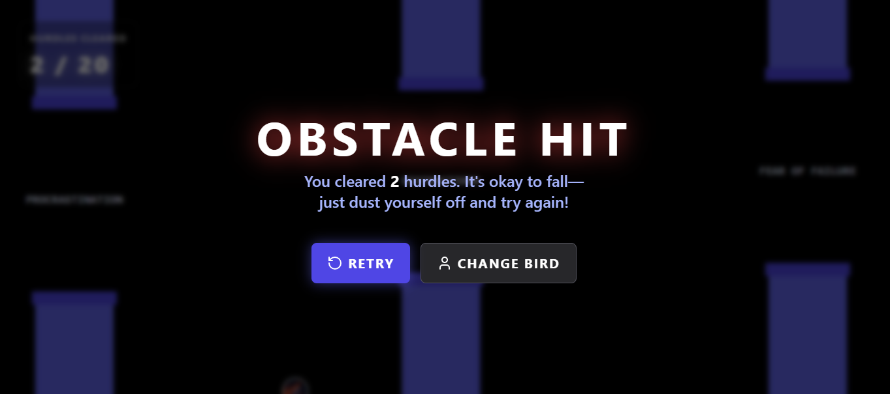
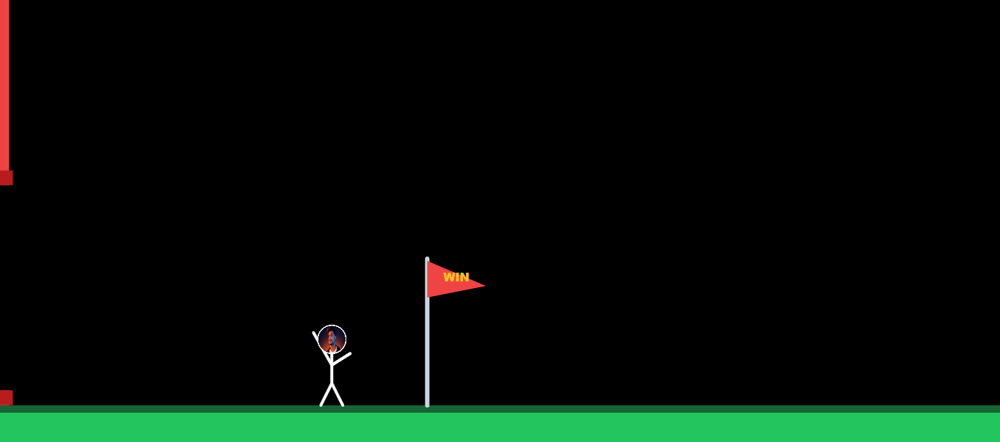
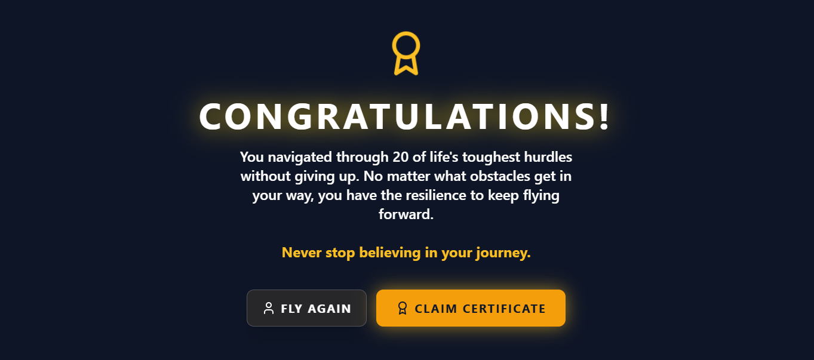

# Flappy Student: The Journey of Resilience

[](https://vercel.com/new/clone?repository-url=https://github.com/yourusername/flappy-student)

A beautiful, interactive web-based game built with Next.js, TypeScript, and Tailwind CSS. It is not just a clone of a classic game; it is a stunning metaphor for life.

## 🚀 Play Live
[**Click here to play Flappy Student!**](https://flappy-student.vercel.app/)

---

## 💡 The Intention (What I Want to Convey)
**"Life is full of unexpected hurdles. Prove that you have the resilience to overcome all 20 of them."**

The deep intention behind *Flappy student* is to convey a powerful, relatable message about perseverance, mental health, and self-belief. Throughout the game, you don't just dodge blue pipes; you face real-life emotional obstacles like **Self-Doubt**, **Procrastination**, and **Fear of Failure**. 

When you inevitably hit an obstacle in the game (and in life), the screen delivers a crucial reminder: 
*"It's okay to fall—just dust yourself off and try again!"* 

The ultimate goal of this project is to navigate through 20 of life's toughest hurdles without giving up entirely. It is a playable artistic reminder that no matter what obstacles get in your way, you have the inner resilience to keep flying forward. Never stop believing in your journey.

---

## 📸 Screenshots

### 1. Choose Your Avatar


### 2. Get Ready for the Journey


### 3. Face Your Hurdles (e.g., Self-Doubt)


### 4. Dust Yourself Off


### 5. Crossing the Finish Line


### 6. Victory & Resilience (Certificate)


---

## ⚙️ Getting Started Locally

First, install the dependencies:
```bash
npm install
```

Then, run the development server:
```bash
npm run dev
# or yarn dev / pnpm dev
```

Open [http://localhost:3000](http://localhost:3000) with your browser to see the result.
